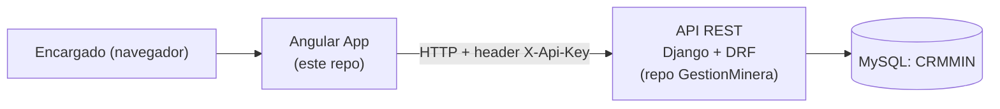

# ERP Minero — Frontend (Angular)

Cliente web construido con **Angular** para la API REST **Gestión Minera** (repositorio backend separado, `GestionMinera`, Django + Django REST Framework). Esta aplicación es la que usan los encargados de área para registrar personal, flota, tickets de pesaje, inventario, mantenimiento, reportes y requerimientos internos, sin acceso directo a la base de datos.

> Backend y frontend son **dos repositorios independientes**. Este repo no contiene ni necesita el código del backend, solo su URL base (ver [Variables de entorno](#variables-de-entorno)).



## Índice

- [Documentación completa](#documentación-completa)
- [Stack tecnológico](#stack-tecnológico)
- [Estructura del repositorio](#estructura-del-repositorio)
- [Puesta en marcha](#puesta-en-marcha)
- [Variables de entorno](#variables-de-entorno)
- [Convenciones de nombres](#convenciones-de-nombres)
- [Módulos implementados](#módulos-implementados)
- [Estado actual del proyecto](#estado-actual-del-proyecto)
- [Scripts disponibles](#scripts-disponibles)

## Documentación completa

| # | Documento | Contenido |
|---|---|---|
| 1 | [Arquitectura del frontend](docs/01-arquitectura-frontend.md) | Capas y carpetas, principios SOLID aplicados con ejemplos concretos, convenciones de nomenclatura, manejo de datos (paginación, decimales, selects con FK) |
| 2 | [Flujo del código](docs/02-flujo-codigo-frontend.md) | Recorrido línea por línea de una acción real (crear y listar empleados): componente → servicio → interceptor → HTTP → backend |
| 3 | [Guía del patrón de módulo](docs/03-guia-nuevo-modulo.md) | Receta paso a paso del patrón que siguen los 15 módulos (útil para modificar uno existente o si el backend agrega una entidad nueva), con tabla de referencia completa |

Estos documentos asumen que ya leíste (o tenés a mano) la documentación del backend `GestionMinera` — en particular su diccionario de datos y su documento de arquitectura técnica — ya que el frontend refleja esos contratos de datos, no los redefine.

## Stack tecnológico

| Componente | Tecnología | Versión |
|---|---|---|
| Framework | Angular (standalone, sin NgModules) | 21 |
| Lenguaje | TypeScript | 5.9 |
| Reactividad / estado local | Signals (`signal()`) | — |
| Formularios | Reactive Forms (`ReactiveFormsModule`) | — |
| HTTP | `HttpClient` + interceptores funcionales | — |
| Testing | Vitest (`@angular/build:unit-test`) | 4 |
| Build | `@angular/build` (esbuild) | 21 |

## Estructura del repositorio

```
erp-minero/
├── src/
│   ├── app/
│   │   ├── core/                 # Infraestructura transversal (cliente HTTP genérico, interceptor de auth, config de navegación)
│   │   │   ├── services/api.ts
│   │   │   ├── interceptors/api-key-interceptor.ts
│   │   │   └── nav-modulos.ts
│   │   ├── models/                # Contratos de datos: uno por entidad + PaginatedResponse<T> + OpcionSelect
│   │   ├── services/               # Un servicio de acceso a datos por entidad (15 en total)
│   │   ├── pages/                  # Componentes ruteados, agrupados por módulo de negocio (15 carpetas)
│   │   ├── app.config.ts           # Providers globales (router, HttpClient, interceptores)
│   │   ├── app.routes.ts           # Rutas de la aplicación (list/nuevo/:id/editar por entidad)
│   │   └── app.ts                  # Shell raíz (nav lateral agrupada + <router-outlet>)
│   ├── environments/                # environment.ts (dev) / environment.prod.ts
│   └── styles.css                   # Estilos globales compartidos (botones, tabla, layout de formularios)
├── docs/                             # Esta documentación
└── angular.json / tsconfig.json      # Configuración de build y path aliases (@core, @models, ...)
```

Ver el detalle de **por qué** está organizado así en [Arquitectura del frontend](docs/01-arquitectura-frontend.md).

## Puesta en marcha

Requisitos previos:

- Node.js 20+ y npm.
- El backend `GestionMinera` corriendo localmente (`python manage.py runserver`, por defecto en `http://127.0.0.1:8000`).
- **Importante:** el backend trae configurado CORS para un frontend Vue (`http://localhost:5173`), no para el puerto por defecto de Angular (`http://localhost:4200`). Hasta que se actualice `CORS_ALLOWED_ORIGINS` en `requerimientos/settings.py` del backend para incluir `http://localhost:4200`, toda petición desde `ng serve` será bloqueada por el navegador (error de CORS en consola, no un error de la API). Ver la nota completa en [Arquitectura del frontend § CORS](docs/01-arquitectura-frontend.md#5-cors-un-desajuste-pendiente-con-el-backend).

```bash
# 1. Instalar dependencias
npm install

# 2. Levantar el servidor de desarrollo (http://localhost:4200)
npm start

# 3. Ejecutar las pruebas unitarias
npm test

# 4. Build de producción
npm run build
```

## Variables de entorno

La URL base de la API y la API Key compartida viven en `src/environments/`, no hardcodeadas en cada servicio:

| Archivo | Uso | `apiUrl` |
|---|---|---|
| `environment.ts` | `ng serve` (desarrollo) | `http://127.0.0.1:8000/api` |
| `environment.prod.ts` | `ng build` (producción, vía `fileReplacements` en `angular.json`) | placeholder a reemplazar en el pipeline de build |

La API Key de desarrollo (`crm-minera-2024`) es la misma que ya está en texto plano en el repositorio del backend (`settings.py`), así que commitearla en `environment.ts` no expone nada nuevo. La de producción **no** debe commitearse: `environment.prod.ts` trae un placeholder que se sobrescribe en el servidor de build.

## Convenciones de nombres

Este proyecto sigue el esquema de generación por defecto del Angular CLI 21 (sin sufijos de tipo en el nombre de archivo ni en la clase, p. ej. `api.ts` → `class Api`, no `api.service.ts` → `class ApiService`), con **una excepción deliberada**: los servicios de acceso a datos de cada entidad sí llevan el sufijo `.service.ts` / `Service` (p. ej. `empleado.service.ts` → `EmpleadoService`), porque el modelo ya ocupa el nombre "pelado" de la entidad (`models/empleado.ts` → `interface Empleado`). Sin el sufijo, ambos símbolos colisionarían al importarlos juntos en un mismo componente. El detalle completo está en [Arquitectura del frontend § Convenciones de nomenclatura](docs/01-arquitectura-frontend.md#4-convenciones-de-nomenclatura).

## Módulos implementados

Los 15 recursos del backend tienen su módulo completo (modelo + servicio + listar + crear + editar + eliminar), agrupados en la navegación igual que en la documentación del backend:

| Módulo de negocio | Entidades |
|---|---|
| Personal y flota | Empleados, Conductores, Encargados, Vehículos |
| Pesaje y transporte | Materiales, Tickets, Gastos de viaje |
| Inventario | Inventarios, Detalles de inventario, Máquinas, Insumos |
| Mantenimiento | Mantenimientos |
| Reportes | Reportes |
| Requerimientos | Requerimientos, Ítems solicitados (detalle) |

Cada uno sigue exactamente el mismo patrón (documentado en [docs/03](docs/03-guia-nuevo-modulo.md)): `EmpleadoService` es el ejemplo de referencia más simple, `TicketForm` el más elaborado (4 selects con FK), y `DetalleInventarioForm`/`MantenimientoForm` son los que refuerzan en el cliente una regla de "uno u otro" que el backend no valida (máquina/insumo, máquina/volquete).

## Estado actual del proyecto

- ✅ Los 15 módulos con CRUD completo: listar (paginado), crear, **editar**, eliminar.
- ✅ Selects de relaciones (FK) resueltos a etiquetas legibles uniendo datos del lado del cliente (`listConLabel()` en cada servicio) — el backend no serializa anidado.
- ✅ Reglas de negocio no validadas por el backend, reforzadas en el cliente: "máquina o insumo" (`DetalleInventarioForm`), "máquina o volquete" (`MantenimientoForm`).
- ✅ Flujo cabecera-detalle asistido: al crear un `Requerimiento`, el formulario de su primer ítem llega con la cabecera preseleccionada.
- ⬜ Manejo de errores global (hoy cada componente atrapa sus propios errores; no hay interceptor de errores ni página 404).
- ⬜ Autenticación de usuario individual — hoy, igual que el backend, toda la app comparte una única API Key (no hay login ni roles en el cliente).
- ⬜ Filtrado/búsqueda en las listas — el backend no lo soporta por query params (ver limitación documentada en el backend), así que cualquier filtro tendría que implementarse sobre los datos ya traídos al cliente.

## Scripts disponibles

| Comando | Qué hace |
|---|---|
| `npm start` | `ng serve` — servidor de desarrollo en `http://localhost:4200` |
| `npm run build` | `ng build` — build de producción en `dist/erp-minero` |
| `npm run watch` | `ng build --watch --configuration development` |
| `npm test` | `ng test` — pruebas unitarias con Vitest |
