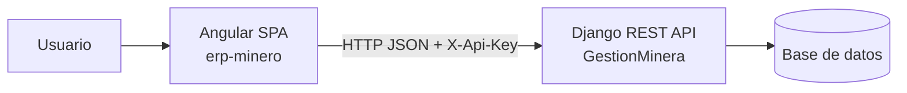
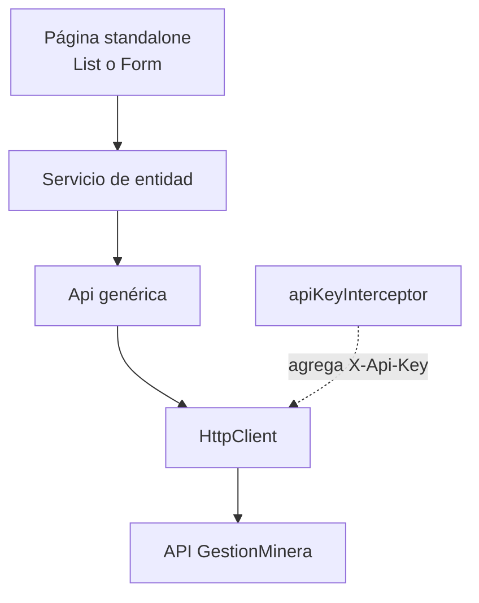

# Contexto operativo para IA — ERP Minero Frontend

> **Propósito.** Este documento es el punto de entrada para una persona o asistente de IA que vaya a entender, mantener o extender el repositorio. Describe el estado comprobable del código, las decisiones que deben preservarse y el proceso para hacer cambios seguros. No sustituye al contrato del backend: el repositorio `GestionMinera` sigue siendo la autoridad para modelos, serializers y reglas de servidor.

> **Lectura mínima antes de cambiar código:** este documento → [arquitectura](01-arquitectura-frontend.md) → la página, modelo y servicio del módulo que se va a tocar. Para crear una entidad nueva, leer además la [guía del patrón](03-guia-nuevo-modulo.md).

## 1. Qué es este repositorio

`erp-minero` es una SPA Angular 21 para el sistema de Gestión Minera. La usan encargados para operar personal, flota, pesaje, inventario, mantenimiento, reportes y requerimientos. No contiene Django ni la base de datos: consume la API REST del repositorio separado `GestionMinera`.



Por tanto, un cambio del frontend **no autoriza** cambiar la semántica del servidor. Si el requerimiento necesita una regla, filtro, campo o endpoint que el contrato no ofrece, se debe señalar como dependencia del backend en vez de simularlo silenciosamente.

## 2. Mapa de lectura rápida

| Necesidad | Archivos que se deben inspeccionar primero |
|---|---|
| Arranque, providers y HTTP | `src/main.ts`, `src/app/app.config.ts`, `src/app/core/services/api.ts`, `src/app/core/interceptors/api-key-interceptor.ts` |
| URLs y carga diferida | `src/app/app.routes.ts` |
| Menú lateral | `src/app/core/nav-modulos.ts`, `src/app/app.ts` |
| Contrato de una entidad | `src/app/models/<entidad>.ts` y `src/app/services/<entidad>.service.ts` |
| Pantalla de negocio | `src/app/pages/<modulo>/<entidad>-list/` o `<entidad>-form/` |
| Utilidades de UI/datos | `src/app/shared/` |
| API y claves por entorno | `src/environments/environment*.ts` |
| Convenciones y paso a paso | [01-arquitectura-frontend.md](01-arquitectura-frontend.md), [02-flujo-codigo-frontend.md](02-flujo-codigo-frontend.md), [03-guia-nuevo-modulo.md](03-guia-nuevo-modulo.md) |

## 3. Arquitectura que se debe conservar

La dirección de dependencias es fija. Una capa solo conoce a la siguiente:



| Capa | Responsabilidad | No debe hacer |
|---|---|---|
| `pages/` | Mostrar datos, validar interacción y coordinar servicios | Llamar `HttpClient`, conocer URLs o repetir la lógica HTTP |
| `services/` | Asociar una entidad TypeScript con su `resource` HTTP y armar etiquetas de FK | Manipular DOM, rutas o estado visual |
| `core/services/api.ts` | CRUD HTTP genérico, paginación y URLs | Conocer entidades de negocio |
| `models/` | Interfaces, tipos unión y constantes de opciones | Ejecutar lógica o solicitudes |
| `shared/` | Funciones puras reutilizables | Inyectar servicios o guardar estado |
| `core/` | Infraestructura transversal y configuración del shell | Contener reglas de una entidad concreta |

La app usa componentes **standalone**, lazy loading por `loadComponent`, inyección con `inject()`, formularios reactivos y `signal()`/`computed()` para estado local. El estilo es Bootstrap 5 directamente en el template; no se debe introducir un sistema visual paralelo para resolver un caso aislado.

## 4. Contrato de transporte

La URL base se toma de `environment.apiUrl`. `Api` genera las rutas con barra final:

| Operación | Método | URL |
|---|---|---|
| Listado paginado | `GET` | `/api/<resource>/?page=<n>` |
| Listado completo | varios `GET` | Sigue los enlaces absolutos de `next` |
| Un registro | `GET` | `/api/<resource>/<id>/` |
| Crear | `POST` | `/api/<resource>/` |
| Reemplazar | `PUT` | `/api/<resource>/<id>/` |
| Actualización puntual | `PATCH` | `/api/<resource>/<id>/` |
| Eliminar | `DELETE` | `/api/<resource>/<id>/` |

El interceptor añade `X-Api-Key` a cada solicitud. La respuesta de cualquier listado es `{ count, next, previous, results }`; el listado visible usa una página y `listAll()` recorre todas las páginas para selects y filtros locales. No asumir que la API entiende `?search=` ni filtros por FK: el proyecto hoy filtra en el cliente.

**Detalles de tipos que evitan errores:**

- Los `DecimalField` se reciben y envían como `string`, nunca como `number`; convertir solo para calcular o mostrar toneladas.
- Las relaciones se serializan como id (`number`), no como objetos anidados.
- Los campos automáticos o calculados se excluyen de los payloads. Ejemplos: `Ticket.fecha_emision`, `Ticket.pesoNeto`, `Inventario.fechaInventario`, `GastoViaje.fecha`, `Reporte.fecha`, `Requerimiento.fecha`.
- La API usa `PUT` para edición estándar. No enviar campos de solo lectura solo porque estén en la interfaz de respuesta.

## 5. Inventario del dominio y endpoints

Las entidades del modelo, los servicios y los nombres de recurso son la referencia local verificable. Los detalles no aparecen como opciones propias del menú porque viven dentro de su cabecera.

| Área | Entidad TypeScript | Resource API | Relación relevante |
|---|---|---|---|
| Personal | `Empleado` | `empleados` | Base de `Conductor` y `Encargado` |
| Personal | `Conductor` | `conductores` | `empleado → Empleado` |
| Personal | `Encargado` | `encargados` | `empleado → Empleado` |
| Flota | `Vehiculo` | `vehiculos` | Referido por Ticket y Mantenimiento (`volquete`) |
| Transporte | `Material` | `materiales` | Referido por Ticket |
| Transporte | `Ticket` | `tickets` | conductor, vehículo, encargado y material; calcula peso neto en servidor |
| Transporte | `GastoViaje` | `gastos_viaje` | `ticket → Ticket` |
| Inventario | `Inventario` | `inventario` | Cabecera; `encargado → Encargado` |
| Inventario | `DetalleInventario` | `detalle_inventario` | `inventario → Inventario`; exactamente una de máquina/insumo |
| Inventario | `Maquina` | `maquinas` | Referida por detalle y mantenimiento |
| Inventario | `Insumo` | `insumos` | Referido por detalle |
| Mantenimiento | `Mantenimiento` | `mantenimientos` | encargado y exactamente una de máquina/volquete |
| Reportes | `Reporte` | `reportes` | `encargado → Encargado` |
| Requerimientos | `Requerimiento` | `requerimientos` | Cabecera; `encargado → Encargado` |
| Requerimientos | `DetalleRequerimiento` | `detalle_requerimientos` | `requerimiento → Requerimiento` |

Rutas de cabecera-detalle:

- Inventario: `/inventarios/:idInventario/detalles`, con variantes `/nuevo` y `/:id/editar`.
- Requerimiento: `/requerimientos/:idRequerimiento/items`, con variantes `/nuevo` y `/:id/editar`.

En ambos casos el id de la cabecera procede de la URL, no de un selector editable. Para mostrar los ítems del padre se solicita la colección y se filtra en cliente porque el backend no expone filtrado por query params.

## 6. Reglas de negocio y excepciones actuales

Estas reglas ya son parte del comportamiento esperado. Antes de alterar alguno de estos formularios, revisar su modelo y servicio además de su componente.

| Caso | Regla implementada | Ubicación principal |
|---|---|---|
| Detalle de inventario | Debe existir máquina **o** insumo, nunca ambos. El campo no seleccionado se envía como `null`. | `detalle-inventario-form` |
| Mantenimiento | Debe existir máquina **o** volquete, nunca ambos. El no elegido se envía como `null`. | `mantenimiento-form` |
| Ticket | El servidor calcula `pesoNeto = pesoBruto - tara`; no incluir peso neto ni fecha de emisión en POST/PUT. | `ticket.ts`, `ticket-form` |
| Máquina | `marca` y `nro_serie` son requeridos por API; si no se informan, se manda `MAQUINA_SIN_ESPECIFICAR`. | `maquina.ts`, `maquina-form` |
| Mantenimiento | Si `descripcion` queda vacía se omite del payload, no se envía `''`. | `mantenimiento.service.ts`, `mantenimiento-form` |
| Requerimiento | Estados estandarizados: pendiente, aprobado, rechazado, atendido. La acción rápida usa PATCH solo para `atendido`. | `requerimiento.ts`, `requerimiento.service.ts` |
| Inventario y requerimiento | La cabecera debe existir antes de crear el detalle; al crear cabecera se navega a sus ítems. | formularios y rutas anidadas |

Los `listConLabel()` pertenecen al servicio de la entidad referenciada. El formulario consumidor recibe solamente `OpcionSelect { id, label }`; no debe reconstruir el nombre visible ni repetir joins de datos.

## 7. Método de trabajo para implementar cambios

1. **Delimitar el cambio.** Identificar el flujo de usuario, entidad, campos afectados y si depende de una capacidad del backend. Consultar primero los archivos del mapa de lectura.
2. **Comprobar el contrato.** Contrastar el modelo local con la documentación/código del backend disponible. No inferir tipos de `Decimal`, campos read-only ni endpoints por el nombre.
3. **Elegir el patrón existente.** Usar `empleados` para CRUD simple; `tickets` para varias FKs; `detalles-inventario` para cabecera-detalle, regla excluyente y alta inline.
4. **Cambiar en la capa correcta.** Modelo para contrato, servicio para acceso/etiquetas, página para experiencia y validación, rutas/nav para exposición. Evitar modificar `Api` si el caso sigue siendo CRUD estándar.
5. **Mantener la coherencia.** Si se añade una entidad completa, actualizar modelo, servicio, listado, formulario, rutas, navegación y documentación. Si es detalle, usar rutas anidadas y no añadir menú propio.
6. **Validar.** Ejecutar `npm run build`; ejecutar `npm test` si cambió lógica cubierta o se agregó cobertura. Revisar manualmente crear, editar, eliminar, error y mobile cuando el cambio es visual.
7. **Documentar.** Actualizar este contexto, la guía de patrón o la arquitectura cuando cambie un contrato, regla, endpoint, ruta, convención o decisión reutilizable.

## 8. Patrones de implementación obligatorios

### Listados

- Mantienen `cargando`, `error` y la colección en signals.
- Usan `busqueda` + `computed()` + `coincideTexto()` para búsqueda local.
- Muestran acciones de editar/eliminar y piden confirmación antes de eliminar.
- Si necesitan etiquetas de relaciones, combinan `listAll()`/`listConLabel()` en el componente con RxJS; no alteran `Api` ni hacen peticiones desde el template.

### Formularios

- Un mismo `XForm` sirve para alta y edición; obtiene `id` de `ActivatedRoute`.
- Usan `FormBuilder`, validadores y mensajes de error antes de invocar el servicio.
- Convierten los valores de controles de tipo `select` a `number` antes del payload.
- Para campos opcionales que el backend no acepta vacíos, omiten la propiedad o envían `null` según el contrato ya documentado.
- Tras guardar, regresan al listado o, en cabecera-detalle nueva, al detalle de la cabecera creada.

### Servicios y modelos

- Todo servicio de recurso expone `list`, `listAll`, `getById`, `create`, `update` y `remove`, salvo que el contrato no permita una operación.
- Declarar un tipo `XCreacion` cuando la respuesta tenga campos no enviables.
- Mantener el `resource` exacto del backend; no derivarlo automáticamente del nombre TypeScript.
- Declarar opciones de `Choice` como unión de literales y array de etiquetas, como `TipoMaterial` y `TIPOS_MATERIAL`.

## 9. Límites conocidos y decisiones pendientes

- No hay autenticación de usuarios, roles ni permisos finos: toda la app usa una API key compartida, igual que la API actual.
- No hay interceptor central de errores ni ruta 404; cada página informa sus errores.
- La búsqueda, los filtros por cabecera y los selects traen datos completos al cliente. Es adecuado para el volumen actual; si crece, el cambio correcto empieza en el backend (filtros/paginación/búsqueda) y después se adapta el frontend.
- Para desarrollo, el backend debe permitir CORS desde `http://localhost:4200`; hoy esa configuración pertenece al otro repositorio.
- `environment.prod.ts` debe recibir una API key segura durante el pipeline de despliegue; no incorporar secretos de producción al repositorio.

## 10. Comandos y criterios de entrega

```bash
npm start        # servidor local en http://localhost:4200
npm run build    # compilación de producción: obligatorio tras cambios de código
npm test         # pruebas unitarias con Vitest
```

Una entrega está lista cuando compila, respeta el contrato y patrón de su módulo, cubre las rutas/estados que cambió y deja actualizada la documentación que otro agente necesitaría para continuar sin redescubrir la decisión.

## 11. Documentación complementaria

- [Arquitectura del frontend](01-arquitectura-frontend.md): decisiones por capa, SOLID, datos y limitaciones.
- [Flujo del código](02-flujo-codigo-frontend.md): recorrido de una acción desde la pantalla hasta la API.
- [Guía del patrón de módulo](03-guia-nuevo-modulo.md): receta y ejemplos para crear o modificar módulos.
- [Guía de despliegue](04-guia-despliegue.md): topología y preparación para producción.

