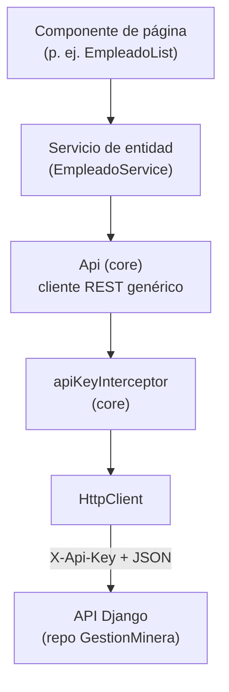
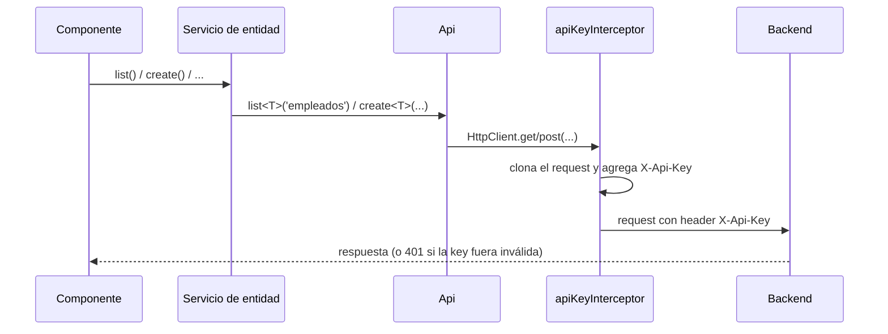

# Arquitectura del Frontend — ERP Minero

> Ver también: [Flujo del código](02-flujo-codigo-frontend.md) · [Guía del patrón de módulo](03-guia-nuevo-modulo.md)

Este documento explica **cómo está organizado el proyecto Angular y por qué**, y cómo se aplican los principios SOLID en una app que cubre las 15 entidades del backend sin volverse inmanejable: cada entidad nueva significa un modelo, un servicio y dos páginas más, nunca un cambio en la infraestructura compartida (`core/`).

## Índice

1. [Visión general](#1-visión-general)
2. [Capas y carpetas](#2-capas-y-carpetas)
3. [Principios SOLID aplicados](#3-principios-solid-aplicados)
4. [Convenciones de nomenclatura](#4-convenciones-de-nomenclatura)
5. [CORS: un desajuste pendiente con el backend](#5-cors-un-desajuste-pendiente-con-el-backend)
6. [Manejo de datos](#6-manejo-de-datos)
7. [Autenticación](#7-autenticación)
8. [Limitaciones conocidas y próximos pasos](#8-limitaciones-conocidas-y-próximos-pasos)

---

## 1. Visión general

Cada flecha es una dependencia en una sola dirección: un componente conoce su servicio de entidad, el servicio de entidad conoce `Api`, y `Api` conoce `HttpClient` y el entorno. Nada depende "hacia arriba". Esto es lo que permitió construir las 15 entidades tocando solo los dos niveles superiores (componente + servicio de entidad) sin nunca modificar `Api` ni el interceptor — en los 15 módulos, `Api` no cambió una sola línea después de escribirse para `Empleado`.

## 2. Capas y carpetas

| Carpeta | Contiene | Responsabilidad |
|---|---|---|
| `app/core/services/` | `Api` | Único punto que sabe hablar HTTP con el backend: arma URLs, delega en `HttpClient`. No sabe qué es un "empleado". |
| `app/core/interceptors/` | `apiKeyInterceptor` | Agrega el header `X-Api-Key` a toda petición saliente. Transversal a toda la app, no pertenece a ningún módulo de negocio. |
| `app/models/` | `Empleado`, `PaginatedResponse<T>`, ... | Contratos de datos puros (interfaces TypeScript). Un archivo por entidad del backend, sin lógica. |
| `app/services/` | `EmpleadoService`, ... | Un servicio por entidad: solo conoce su `resource` (p. ej. `'empleados'`) y su tipo (`Empleado`). Delega toda la mecánica HTTP en `Api`. |
| `app/pages/<módulo>/` | `EmpleadoList`, `EmpleadoForm`, ... | Componentes ruteados (pantallas). Agrupados por módulo de negocio, no por tipo de archivo — así al abrir `pages/empleados/` se ve todo lo que involucra esa pantalla. Cada `XForm` sirve tanto de alta como de edición (ver [§6](#6-manejo-de-datos)). |
| `app/core/nav-modulos.ts` | `NAV_MODULOS` | Estructura del menú lateral, agrupada por módulo de negocio igual que la documentación del backend. Config del shell, no de ninguna entidad — vive en `core/` por el mismo criterio que `Api`. |
| `environments/` | `environment.ts`, `environment.prod.ts` | `apiUrl` y `apiKey` por entorno de build (ver [README](../README.md#variables-de-entorno)). |

`core/` existe como carpeta separada de `services/` a propósito: todo lo que vive en `core/` se instancia **una sola vez** y no sabe nada del dominio (personal, flota, tickets...); todo lo que vive en `services/` es **por entidad** y sabe exactamente un recurso. Mezclar ambos en una sola carpeta plana funcionaría hoy con una entidad, pero se vuelve confuso con quince.

No existe todavía una carpeta `shared/` (componentes de UI reutilizables como una tabla paginada o un spinner). Se agrega el día que un segundo módulo necesite repetir un componente de `pages/empleados/` — extraerla antes sería adivinar una abstracción que todavía no hace falta.

## 3. Principios SOLID aplicados

| Principio | Dónde se ve | Explicación |
|---|---|---|
| **S — Responsabilidad única** | `Api` vs. `EmpleadoService` vs. `EmpleadoList` | `Api` solo sabe hacer HTTP; `EmpleadoService` solo sabe que su recurso es `'empleados'`; `EmpleadoList` solo sabe mostrar y reaccionar a clics. Ninguna clase mezcla las tres cosas. |
| **O — Abierto/cerrado** | `Api` (`src/app/core/services/api.ts`) | Cada una de las 15 entidades tiene su propio servicio (`VehiculoService`, `TicketService`, ...) que reutiliza `Api` tal cual. `Api` no se modificó una sola vez al agregar las 14 entidades posteriores a `Empleado` — está cerrada a modificación, abierta a extensión por composición. |
| **L — Sustitución de Liskov** | Los 15 servicios de entidad (`EmpleadoService`, `VehiculoService`, `TicketService`, ...) | Todos exponen la misma forma (`list/listAll/getById/create/update/remove` devolviendo `Observable<...>`). Un componente de página que sabe consumir esa forma funciona igual sin importar qué entidad haya detrás — por eso `EmpleadoForm` y `TicketForm` comparten la misma estructura interna pese a que uno tiene 1 FK y el otro 4. |
| **I — Segregación de interfaces** | `models/empleado.ts` vs. `models/pagination.ts` | El modelo de una entidad no carga con la forma de la paginación (`count/next/previous`); son tipos separados que se combinan solo donde hace falta (`PaginatedResponse<Empleado>`), no un tipo gigante con todo mezclado. |
| **D — Inversión de dependencias** | `inject(Api)` en `EmpleadoService`, `inject(EmpleadoService)` en `EmpleadoList` | Los componentes dependen de `EmpleadoService` (una abstracción inyectable), nunca de `HttpClient` directamente. `EmpleadoService` recibe `Api` por inyección de Angular en vez de instanciarlo (`new Api()`). Esto es lo que permite reemplazar cualquier pieza en un test sin tocar las demás. |

## 4. Convenciones de nomenclatura

Angular CLI 21 genera archivos y clases **sin sufijo de tipo** por defecto (`ng generate service api` produce `api.ts` con `class Api`, no `api.service.ts` con `class ApiService`). Este proyecto sigue esa convención, con una excepción:

> Los servicios de acceso a datos de cada entidad conservan el sufijo `Service` (`empleado.service.ts` → `EmpleadoService`), porque el modelo de esa misma entidad ya ocupa el nombre limpio (`models/empleado.ts` → `interface Empleado`). Sin el sufijo, un componente que necesita importar ambos (`Empleado` y su servicio) tendría dos símbolos con el mismo nombre y tendría que renombrar uno al importarlo — más confuso que el sufijo mismo.

Fuera de ese caso puntual, no se agregan sufijos por costumbre: ni a componentes (`EmpleadoList`, no `EmpleadoListComponent`) ni al servicio genérico (`Api`, no `ApiService`).

## 5. CORS: un desajuste pendiente con el backend

La documentación del backend (`GestionMinera/requerimientos/settings.py`) tiene `CORS_ALLOWED_ORIGINS` configurado para un frontend Vue (`http://localhost:5173`) y un cliente de pruebas (`http://127.0.0.1:5500`) — reflejo de que el frontend se planeó originalmente en Vue.js. Este proyecto es Angular, cuyo servidor de desarrollo corre por defecto en **`http://localhost:4200`**, un origen que hoy **no** está en esa lista.

Consecuencia práctica: hasta que alguien agregue `http://localhost:4200` a `CORS_ALLOWED_ORIGINS` en el backend, el navegador va a bloquear (con un error de CORS, no un 401 ni un error de red) toda petición que salga de `ng serve`. Esto es independiente de que la API Key esté bien configurada — CORS se evalúa en el navegador antes de que el header `X-Api-Key` llegue a importar.

Este repositorio no puede arreglar esto por sí solo porque el cambio vive en el otro repositorio (`GestionMinera`). Es un paso manual pendiente de coordinar con quien mantiene el backend.

## 6. Manejo de datos

- **Paginación:** toda respuesta de listado del backend tiene la forma `{ count, next, previous, results }` (`PageNumberPagination`, `PAGE_SIZE=20`). Se modela una sola vez en `models/pagination.ts` (`PaginatedResponse<T>`) y la reutiliza `Api.list<T>()` para cualquier entidad.
- **Campos `Decimal` como texto:** el backend serializa todo `DecimalField` (montos, pesos, tara) como **string** (p. ej. `"32500.00"`), no como número, para no perder precisión. Al modelar entidades con este tipo de campo (`Vehiculo.tara`, `Ticket.pesoBruto`, `GastoViaje.monto`, ...) el tipo TypeScript correspondiente debe ser `string`, y cualquier cálculo en el cliente debe parsearlo explícitamente (`Number(...)` o `parseFloat(...)`) antes de operar. `Empleado` no tiene este caso (todos sus campos son texto o entero), pero es el primer punto a revisar al construir el siguiente módulo — ver [Guía para agregar un módulo nuevo](03-guia-nuevo-modulo.md).
- **Patrón cabecera-detalle:** dos pares de entidades del backend (`Inventario`/`DetalleInventario`, `Requerimientos`/`DetalleRequerimientos`) requieren dos llamadas secuenciales (crear cabecera, leer su `id`, crear cada detalle referenciando ese `id`). El patrón `Api`/`EmpleadoService` de este proyecto no necesita cambios para soportarlo. En `RequerimientoForm`, al crear una cabecera nueva la app navega directo a `DetalleRequerimientoForm` pasando el `id` recién creado por *query param* (`?requerimiento=7`), que el formulario de detalle lee para preseleccionar el select — así se resuelve en la UI el paso manual que la documentación del backend describe ("guardar el id temporalmente"). No hay soporte (ni falta) de serialización anidada, porque el backend tampoco la tiene.
- **Selects que referencian otra entidad (FK):** el backend no serializa anidado — un `Ticket` trae `conductor: 3`, no el objeto `Conductor` completo — así que ningún `<select>` puede mostrar un id pelado y esperar que el usuario reconozca de quién se trata. Cada servicio de entidad expone un método `listConLabel(): Observable<OpcionSelect[]>` (`OpcionSelect = { id, label }`, en `models/opcion-select.ts`) que arma una etiqueta legible a partir de sus propios campos — y, cuando hace falta, uniendo del lado del cliente con otra entidad (`ConductorService.listConLabel()` trae también `/api/empleados/` para poder mostrar el nombre, no solo la licencia). El componente que necesita el select nunca arma el label él mismo: solo llama a `listConLabel()` del servicio correspondiente. Esto es el mismo principio de responsabilidad única de la sección 3 aplicado a "cómo se muestra una entidad", no solo a "cómo se guarda".
- **`Api.listAll()`:** los selects necesitan **todas** las opciones, no una página de 20 (`Api.list()` está pensado para listados paginados). `Api.listAll<T>(resource)` seguí el campo `next` de la respuesta de DRF con el operador `expand` de RxJS hasta agotar las páginas, y devuelve un array plano. Es el único método de `Api` que hace más de una petición HTTP.
- **Reglas "uno u otro" no validadas por el backend:** `DetalleInventario.maquina`/`.insumo` y `Mantenimiento.maquina`/`.volquete` son ambos opcionales a nivel de backend, sin restricción de exclusividad. `DetalleInventarioForm` y `MantenimientoForm` la refuerzan con un signal (`tipoItem`/`tipoObjetivo`) que vive **fuera** del `FormGroup` — decisión deliberada: un signal siempre dispara la reactividad del template al cambiar, mientras que leer `formulario.value` dentro de un `@if` depende de que algo más dispare la detección de cambios. Al guardar, el campo no elegido se manda explícitamente en `null`.
- **Un mismo `XForm` para crear y editar:** ninguna entidad tiene un componente separado para edición. La ruta `recurso/nuevo` y `recurso/:id/editar` cargan el mismo `XForm`; el componente lee `route.snapshot.paramMap.get('id')` una sola vez al construirse y, si existe, precarga el registro con `getById()` (convirtiendo a `string` los campos que son FK, porque el `<select>` los maneja como texto) y llama a `update()` en vez de `create()` al guardar. Evita duplicar la plantilla y la validación del formulario para lo que en la práctica es la misma pantalla con datos distintos.

## 7. Autenticación

No hay login ni sesión de usuario en el cliente: como el backend mismo documenta, toda la app comparte una única API Key (leída de `environment.apiKey`), igual para todos los que la usan. El interceptor (`core/interceptors/api-key-interceptor.ts`) es el único lugar que conoce ese detalle; ningún servicio de entidad ni componente agrega el header manualmente.

## 8. Limitaciones conocidas y próximos pasos

Notas honestas sobre el estado actual, para quien continúe este proyecto:

- No hay interceptor de manejo de errores global: cada componente atrapa sus propios errores de HTTP con el mismo patrón (`.subscribe({ error: () => this.error.set('...') })`). Con 15 módulos repitiendo ese patrón, probablemente convenga centralizarlo — es el candidato más claro a refactor si el proyecto sigue creciendo.
- No hay página 404 ni guardas de ruta (`CanActivate`) — no hacen falta todavía porque no hay autenticación de usuario individual que proteger.
- El backend no soporta filtrado ni búsqueda por query params (ver su propia documentación de arquitectura técnica): cualquier pantalla que necesite "los detalles de este inventario" o "los tickets de este conductor" trae la colección paginada completa y filtra del lado del cliente (o, como en las listas de `DetalleInventario`/`DetalleRequerimiento`, simplemente lista todo sin filtrar por cabecera todavía). Vale la pena tenerlo presente antes de asumir que un `VehiculoService.list()` puede filtrar por servidor.
- Los selects de FK (`listConLabel()`) traen **todas** las filas de la entidad referenciada con `Api.listAll()`, sin paginar ni virtualizar. Es aceptable con decenas o cientos de registros (empleados, vehículos); si algún catálogo creciera a miles de filas, un `<select>` simple dejaría de ser una buena UI de todos modos — el problema se resolvería con un componente de autocompletar, no ajustando `Api`.
- Las validaciones de formulario son silenciosas: si el usuario intenta guardar con campos inválidos, `guardar()` corta con `markAllAsTouched()` pero ningún template muestra mensajes de error por campo (solo errores de servidor, en `error()`). Es una limitación de UX conocida, no un olvido — añadir mensajes por campo es mecánico pero repetitivo en 15 formularios.
