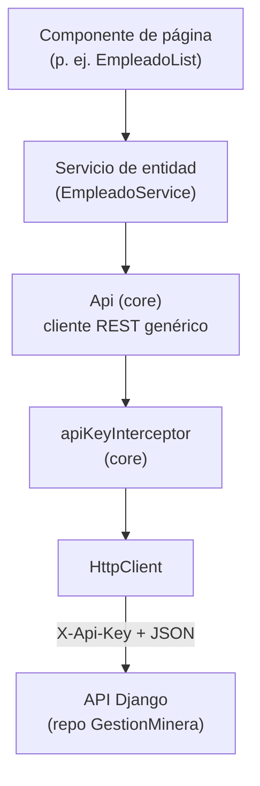
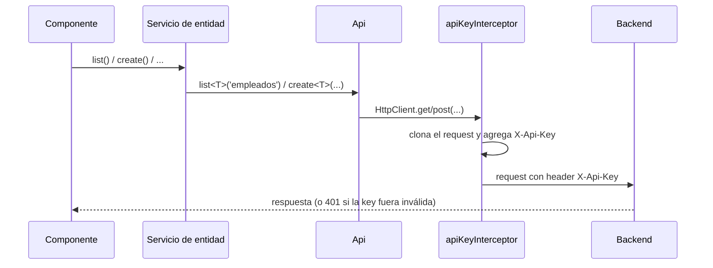

# Arquitectura del Frontend — ERP Minero

> Ver también: [Flujo del código](02-flujo-codigo-frontend.md) · [Guía para agregar un módulo nuevo](03-guia-nuevo-modulo.md)

Este documento explica **cómo está organizado el proyecto Angular y por qué**, y cómo se aplican los principios SOLID en una app que, por diseño, va a crecer a 15 entidades (una por recurso del backend) sin volverse inmanejable.

## Índice

1. [Visión general](#1-visión-general)
2. [Capas y carpetas](#2-capas-y-carpetas)
3. [Principios SOLID aplicados](#3-principios-solid-aplicados)
4. [Convenciones de nomenclatura](#4-convenciones-de-nomenclatura)
5. [CORS: un desajuste pendiente con el backend](#5-cors-un-desajuste-pendiente-con-el-backend)
6. [Manejo de datos](#6-manejo-de-datos)
7. [Autenticación](#7-autenticación)
8. [Limitaciones conocidas y próximos pasos](#8-limitaciones-conocidas-y-próximos-pasos)

---

## 1. Visión general

Cada flecha es una dependencia en una sola dirección: un componente conoce su servicio de entidad, el servicio de entidad conoce `Api`, y `Api` conoce `HttpClient` y el entorno. Nada depende "hacia arriba". Esto es lo que hace posible agregar las 14 entidades restantes tocando solo los dos niveles superiores (componente + servicio de entidad) sin nunca modificar `Api` ni el interceptor.

## 2. Capas y carpetas

| Carpeta | Contiene | Responsabilidad |
|---|---|---|
| `app/core/services/` | `Api` | Único punto que sabe hablar HTTP con el backend: arma URLs, delega en `HttpClient`. No sabe qué es un "empleado". |
| `app/core/interceptors/` | `apiKeyInterceptor` | Agrega el header `X-Api-Key` a toda petición saliente. Transversal a toda la app, no pertenece a ningún módulo de negocio. |
| `app/models/` | `Empleado`, `PaginatedResponse<T>`, ... | Contratos de datos puros (interfaces TypeScript). Un archivo por entidad del backend, sin lógica. |
| `app/services/` | `EmpleadoService`, ... | Un servicio por entidad: solo conoce su `resource` (p. ej. `'empleados'`) y su tipo (`Empleado`). Delega toda la mecánica HTTP en `Api`. |
| `app/pages/<módulo>/` | `EmpleadoList`, `EmpleadoForm`, ... | Componentes ruteados (pantallas). Agrupados por módulo de negocio, no por tipo de archivo — así al abrir `pages/empleados/` se ve todo lo que involucra esa pantalla. |
| `environments/` | `environment.ts`, `environment.prod.ts` | `apiUrl` y `apiKey` por entorno de build (ver [README](../README.md#variables-de-entorno)). |

`core/` existe como carpeta separada de `services/` a propósito: todo lo que vive en `core/` se instancia **una sola vez** y no sabe nada del dominio (personal, flota, tickets...); todo lo que vive en `services/` es **por entidad** y sabe exactamente un recurso. Mezclar ambos en una sola carpeta plana funcionaría hoy con una entidad, pero se vuelve confuso con quince.

No existe todavía una carpeta `shared/` (componentes de UI reutilizables como una tabla paginada o un spinner). Se agrega el día que un segundo módulo necesite repetir un componente de `pages/empleados/` — extraerla antes sería adivinar una abstracción que todavía no hace falta.

## 3. Principios SOLID aplicados

| Principio | Dónde se ve | Explicación |
|---|---|---|
| **S — Responsabilidad única** | `Api` vs. `EmpleadoService` vs. `EmpleadoList` | `Api` solo sabe hacer HTTP; `EmpleadoService` solo sabe que su recurso es `'empleados'`; `EmpleadoList` solo sabe mostrar y reaccionar a clics. Ninguna clase mezcla las tres cosas. |
| **O — Abierto/cerrado** | `Api` (`src/app/core/services/api.ts`) | Para soportar una entidad nueva (p. ej. `Vehiculo`) se escribe un `VehiculoService` nuevo que reutiliza `Api` tal cual. `Api` nunca se modifica para agregar entidades — está cerrada a modificación, abierta a extensión por composición. |
| **L — Sustitución de Liskov** | Cualquier servicio de entidad (`EmpleadoService`, futuro `VehiculoService`, ...) | Todos exponen la misma forma (`list/getById/create/update/remove` devolviendo `Observable<...>`). Un componente de página que sabe consumir esa forma funciona igual sin importar qué entidad haya detrás. |
| **I — Segregación de interfaces** | `models/empleado.ts` vs. `models/pagination.ts` | El modelo de una entidad no carga con la forma de la paginación (`count/next/previous`); son tipos separados que se combinan solo donde hace falta (`PaginatedResponse<Empleado>`), no un tipo gigante con todo mezclado. |
| **D — Inversión de dependencias** | `inject(Api)` en `EmpleadoService`, `inject(EmpleadoService)` en `EmpleadoList` | Los componentes dependen de `EmpleadoService` (una abstracción inyectable), nunca de `HttpClient` directamente. `EmpleadoService` recibe `Api` por inyección de Angular en vez de instanciarlo (`new Api()`). Esto es lo que permite reemplazar cualquier pieza en un test sin tocar las demás. |

## 4. Convenciones de nomenclatura

Angular CLI 21 genera archivos y clases **sin sufijo de tipo** por defecto (`ng generate service api` produce `api.ts` con `class Api`, no `api.service.ts` con `class ApiService`). Este proyecto sigue esa convención, con una excepción:

> Los servicios de acceso a datos de cada entidad conservan el sufijo `Service` (`empleado.service.ts` → `EmpleadoService`), porque el modelo de esa misma entidad ya ocupa el nombre limpio (`models/empleado.ts` → `interface Empleado`). Sin el sufijo, un componente que necesita importar ambos (`Empleado` y su servicio) tendría dos símbolos con el mismo nombre y tendría que renombrar uno al importarlo — más confuso que el sufijo mismo.

Fuera de ese caso puntual, no se agregan sufijos por costumbre: ni a componentes (`EmpleadoList`, no `EmpleadoListComponent`) ni al servicio genérico (`Api`, no `ApiService`).

## 5. CORS: un desajuste pendiente con el backend

La documentación del backend (`GestionMinera/requerimientos/settings.py`) tiene `CORS_ALLOWED_ORIGINS` configurado para un frontend Vue (`http://localhost:5173`) y un cliente de pruebas (`http://127.0.0.1:5500`) — reflejo de que el frontend se planeó originalmente en Vue.js. Este proyecto es Angular, cuyo servidor de desarrollo corre por defecto en **`http://localhost:4200`**, un origen que hoy **no** está en esa lista.

Consecuencia práctica: hasta que alguien agregue `http://localhost:4200` a `CORS_ALLOWED_ORIGINS` en el backend, el navegador va a bloquear (con un error de CORS, no un 401 ni un error de red) toda petición que salga de `ng serve`. Esto es independiente de que la API Key esté bien configurada — CORS se evalúa en el navegador antes de que el header `X-Api-Key` llegue a importar.

Este repositorio no puede arreglar esto por sí solo porque el cambio vive en el otro repositorio (`GestionMinera`). Es un paso manual pendiente de coordinar con quien mantiene el backend.

## 6. Manejo de datos

- **Paginación:** toda respuesta de listado del backend tiene la forma `{ count, next, previous, results }` (`PageNumberPagination`, `PAGE_SIZE=20`). Se modela una sola vez en `models/pagination.ts` (`PaginatedResponse<T>`) y la reutiliza `Api.list<T>()` para cualquier entidad.
- **Campos `Decimal` como texto:** el backend serializa todo `DecimalField` (montos, pesos, tara) como **string** (p. ej. `"32500.00"`), no como número, para no perder precisión. Al modelar entidades con este tipo de campo (`Vehiculo.tara`, `Ticket.pesoBruto`, `GastoViaje.monto`, ...) el tipo TypeScript correspondiente debe ser `string`, y cualquier cálculo en el cliente debe parsearlo explícitamente (`Number(...)` o `parseFloat(...)`) antes de operar. `Empleado` no tiene este caso (todos sus campos son texto o entero), pero es el primer punto a revisar al construir el siguiente módulo — ver [Guía para agregar un módulo nuevo](03-guia-nuevo-modulo.md).
- **Patrón cabecera-detalle:** dos pares de entidades del backend (`Inventario`/`DetalleInventario`, `Requerimientos`/`DetalleRequerimientos`) requieren dos llamadas secuenciales (crear cabecera, leer su `id`, crear cada detalle referenciando ese `id`). El patrón `Api`/`EmpleadoService` de este proyecto no necesita cambios para soportarlo: simplemente el componente de página que implemente ese flujo hará dos `subscribe` encadenados en vez de uno. No hay soporte (ni falta) de serialización anidada, porque el backend tampoco la tiene.

## 7. Autenticación

No hay login ni sesión de usuario en el cliente: como el backend mismo documenta, toda la app comparte una única API Key (leída de `environment.apiKey`), igual para todos los que la usan. El interceptor (`core/interceptors/api-key-interceptor.ts`) es el único lugar que conoce ese detalle; ningún servicio de entidad ni componente agrega el header manualmente.

## 8. Limitaciones conocidas y próximos pasos

Notas honestas sobre el estado actual, para quien continúe este proyecto:

- No hay interceptor de manejo de errores global: cada componente atrapa sus propios errores de HTTP (ver `EmpleadoList`/`EmpleadoForm`). Con más de un módulo, probablemente convenga centralizar esto.
- No hay página 404 ni guardas de ruta (`CanActivate`) — no hacen falta todavía porque no hay autenticación de usuario individual que proteger.
- `EmpleadoService.update`/`.remove` ya existen pero no tienen todavía una pantalla que los use (falta "editar empleado").
- El backend no soporta filtrado ni búsqueda por query params (ver su propia documentación de arquitectura técnica): cualquier pantalla que necesite "los detalles de este inventario" o "los tickets de este conductor" va a tener que traer la colección paginada completa y filtrar del lado del cliente. Vale la pena tenerlo presente antes de asumir que un futuro `VehiculoService.list()` puede filtrar por servidor.
