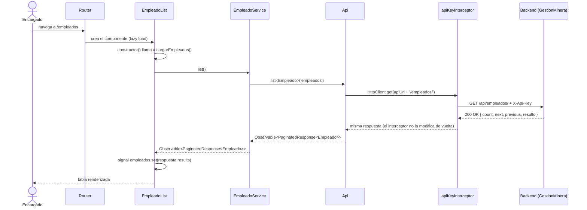
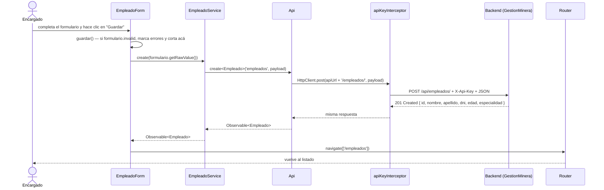

# Flujo del Código — De un Clic a la Base de Datos

> Ver también: [Arquitectura del frontend](01-arquitectura-frontend.md) · [Guía para agregar un módulo nuevo](03-guia-nuevo-modulo.md)

Este documento recorre, archivo por archivo, qué pasa realmente cuando alguien usa la pantalla de empleados. Es el equivalente, del lado del frontend, al documento `04-flujo-codigo.md` del repositorio backend (`GestionMinera/docs/`) — léanse en conjunto para tener la petición completa, de un extremo al otro. Al ser dos repositorios separados, no se enlazan entre sí como archivos relativos; buscá ese documento dentro del repo del backend.

## Índice

1. [Mapa de responsabilidades por archivo](#1-mapa-de-responsabilidades-por-archivo)
2. [Recorrido paso a paso: listar empleados](#2-recorrido-paso-a-paso-listar-empleados)
3. [Recorrido paso a paso: crear un empleado](#3-recorrido-paso-a-paso-crear-un-empleado)
4. [Ejemplo end-to-end con JSON real](#4-ejemplo-end-to-end-con-json-real)

---

## 1. Mapa de responsabilidades por archivo

| Archivo | Responsabilidad |
|---|---|
| [`app.config.ts`](../src/app/app.config.ts) | Registra el router y `HttpClient` con `apiKeyInterceptor` para toda la app |
| [`app.routes.ts`](../src/app/app.routes.ts) | Asocia cada URL con el componente de página que carga (`loadComponent`, lazy) |
| [`pages/empleados/empleado-list/empleado-list.ts`](../src/app/pages/empleados/empleado-list/empleado-list.ts) | Pantalla de listado: pide los datos al entrar, muestra estado de carga/error, dispara la eliminación |
| [`pages/empleados/empleado-form/empleado-form.ts`](../src/app/pages/empleados/empleado-form/empleado-form.ts) | Pantalla de alta: arma el formulario reactivo, valida y crea el empleado |
| [`services/empleado.service.ts`](../src/app/services/empleado.service.ts) | Sabe que la entidad `Empleado` vive en el recurso `'empleados'`; traduce llamadas de negocio a llamadas de `Api` |
| [`core/services/api.ts`](../src/app/core/services/api.ts) | Arma las URLs (`{apiUrl}/{resource}/`) y ejecuta el verbo HTTP correspondiente con `HttpClient` |
| [`core/interceptors/api-key-interceptor.ts`](../src/app/core/interceptors/api-key-interceptor.ts) | Clona cada request saliente y le agrega el header `X-Api-Key` |
| [`models/empleado.ts`](../src/app/models/empleado.ts) / [`models/pagination.ts`](../src/app/models/pagination.ts) | Forma de los datos: qué campos tiene un `Empleado`, qué forma tiene una respuesta paginada |
| `environments/environment.ts` | `apiUrl` y `apiKey` del entorno activo |

## 2. Recorrido paso a paso: listar empleados



**Explicación de cada paso:**

1. El usuario navega a `/empleados` (o la app arranca ahí: `app.routes.ts` redirige `''` a `'empleados'`).
2. El router resuelve la ruta con `loadComponent`, así que el código de `EmpleadoList` recién se descarga en ese momento (chunk separado, confirmado en el build: `empleado-list` y `empleado-form` son bundles independientes del inicial).
3. El `constructor()` de `EmpleadoList` llama a `cargarEmpleados()`, que pone `cargando.set(true)` y se suscribe a `empleadoService.list()`.
4. `EmpleadoService.list()` no sabe nada de HTTP: delega en `this.api.list<Empleado>('empleados', page)`.
5. `Api.list()` arma la URL final (`${environment.apiUrl}/empleados/`) y llama a `HttpClient.get`.
6. Antes de salir a la red, `apiKeyInterceptor` intercepta el request, lo clona con `setHeaders: { 'X-Api-Key': environment.apiKey }` y recién ahí lo deja continuar — sin este paso, el backend respondería `401` (ver `APIKeyAuthentication` en el backend).
7. El backend responde `200 OK` con el sobre de paginación de DRF: `{ count, next, previous, results }`.
8. La respuesta sube sin transformarse por las mismas capas: `Api` la tipa como `PaginatedResponse<Empleado>`, `EmpleadoService` la reexpone tal cual.
9. `EmpleadoList` recibe la respuesta en el callback `next` del `subscribe`, guarda `respuesta.results` en el signal `empleados` y apaga `cargando`. La plantilla (`empleado-list.html`), reactiva a esos signals, redibuja la tabla sola.
10. Si el paso 6 en adelante falla (backend caído, CORS, red), el callback `error` del `subscribe` pone un mensaje en el signal `error` y la plantilla muestra ese mensaje en vez de la tabla — verificado manualmente: con el backend apagado, la pantalla cae limpiamente en *"No se pudo cargar la lista de empleados"* en vez de quedarse cargando para siempre o mostrar un error crudo de consola.

## 3. Recorrido paso a paso: crear un empleado



**Puntos importantes:**

- La validación del lado del cliente (`Validators.required`, `maxLength(8)` en `dni`, `min(18)` en `edad`) corre **antes** de llamar al servicio; si falla, `guardar()` corta ahí y nunca sale una petición HTTP. Esto es una comodidad para el usuario, no un reemplazo de la validación del backend: el backend igual puede rechazar con `400` (p. ej. un `dni` duplicado, que el formulario no puede saber de antemano sin consultarlo).
- Si el backend responde `400` (por ejemplo, `dni` duplicado — es único en el modelo `Empleado`), hoy `EmpleadoForm` muestra un mensaje genérico ("No se pudo guardar el empleado..."). Todavía no distingue *por qué* falló leyendo el cuerpo del error; es una mejora natural para cuando haya más de un tipo de validación cruzada que reportar (ver [Arquitectura § Limitaciones conocidas](01-arquitectura-frontend.md#8-limitaciones-conocidas-y-próximos-pasos)).
- `id` nunca se envía en el payload: el tipo del parámetro de `EmpleadoService.create` es `Omit<Empleado, 'id'>`, así que intentar mandarlo sería un error de compilación, no un error en tiempo de ejecución.

## 4. Ejemplo end-to-end con JSON real

Petición que sale del navegador al hacer clic en "Guardar" con el formulario completo:

```
POST http://127.0.0.1:8000/api/empleados/
X-Api-Key: crm-minera-2024
Content-Type: application/json

{
  "nombre": "Juan",
  "apellido": "Perez",
  "dni": "12345678",
  "edad": 18,
  "especialidad": "Operador de volquete"
}
```

Respuesta esperada del backend (ver el diccionario de datos de `Empleado` en `GestionMinera/docs/01-proyecto.md`):

```
201 Created

{
  "id": 7,
  "nombre": "Juan",
  "apellido": "Perez",
  "dni": "12345678",
  "edad": 18,
  "especialidad": "Operador de volquete"
}
```

Con esa respuesta, `EmpleadoForm` no hace nada con el cuerpo — solo le importa que la petición haya tenido éxito para navegar de vuelta a `/empleados`, donde `EmpleadoList` vuelve a pedir la lista completa y ahí sí aparece el nuevo registro.
